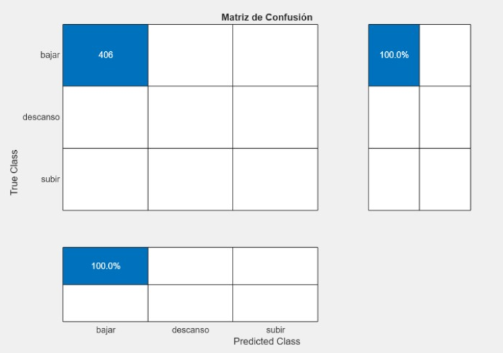

## MODO A: Carga y proceso de archivo  

Este proyecto es una aplicación de **Interfaz Gráfica de Usuario (GUI)** desarrollada en **MATLAB App Designer (.mlapp)**.  
Su objetivo principal es **cargar las mediciones de un sensor IMU (Unidad de Medición Inercial)**, procesar las señales para extraer características relevantes y, finalmente, **utilizar un modelo de Machine Learning preentrenado** para clasificar la actividad registrada: **ascenso, descenso de escaleras o estado de reposo**.

---

### Prerrequisitos
- **MATLAB R2025a** o posterior.  
- **Statistics and Machine Learning Toolbox:** para cargar y ejecutar modelos de ML preentrenados.  
- **Signal Processing Toolbox:** para el preprocesamiento y extracción de características.  
- **`ModeloFinal_ArbolDecision.mat`:** modelo de árbol de decisión preentrenado (debe estar en la misma carpeta que la app).  

---

###  Funcionalidades

####  Importación de datos
Carga el archivo `251030143106.csv` que contiene mediciones registradas por el sensor inercial.  
Estas mediciones incluyen tres canales principales: **acelerómetro, giroscopio y ángulo**.

####  Preprocesamiento
Se aplica un **filtro digital Butterworth** para eliminar el ruido de alta frecuencia y mejorar la calidad de la señal.

####  Segmentación de ventanas
La señal se divide en **ventanas de 2 segundos** con un **50 % de solapamiento**, generando una **matriz de características** donde cada fila corresponde a una ventana.

####  Extracción de características
De cada ventana segmentada se calculan **10 atributos por canal**, obteniendo un total de:  
> 🔹 3 canales × 10 atributos × 3 señales = **90 características extraídas**

#####  Atributos temporales
| Atributo                         | Descripción                                                             |
| -------------------------------- | ----------------------------------------------------------------------- |
| **media (`mean`)**               | Promedio de los valores del canal. Indica tendencia central.            |
| **desviación estándar (`stdv`)** | Mide la variabilidad de la señal.                                       |
| **RMS (`rmsv`)**                 | Raíz cuadrática media, refleja la energía promedio.                     |
| **máximo (`maxv`)**              | Valor pico dentro de la ventana.                                        |
| **mínimo (`minv`)**              | Valor más bajo dentro de la ventana.                                    |
| **asimetría (`skew`)**           | Mide la simetría de la distribución respecto a la media. |
| **curtosis (`kurt`)**            | Indica cuán “afilada” o concentrada está la distribución.               |

#####  Atributos frecuenciales
| Atributo                           | Descripción                                                                          |
| ---------------------------------- | ------------------------------------------------------------------------------------ |
| **energía (`energia`)**            | Suma del cuadrado de las magnitudes espectrales, mide la potencia total de la señal. |
| **frecuencia dominante (`f_dom`)** | Frecuencia donde el espectro tiene su máximo pico.                                   |
| **frecuencia media (`f_media`)**   | Promedio ponderado de las frecuencias según su potencia.                             |

####  Selección automática de características
Se aplica una **poda por correlación** que reduce la dimensionalidad seleccionando las **10 características más relevantes** de las **90 originales**.

####  Clasificación
El modelo **Árbol de Decisión** (`ModeloFinal_ArbolDecision.mat`) predice la clase de actividad:  
> **Subir escaleras**, **Bajar escaleras** o **Reposo**.  

Además, la app genera una **matriz de confusión** que permite visualizar el rendimiento del modelo comparando las predicciones con las etiquetas reales del usuario.

📁 **Estructura de salida esperada:**

